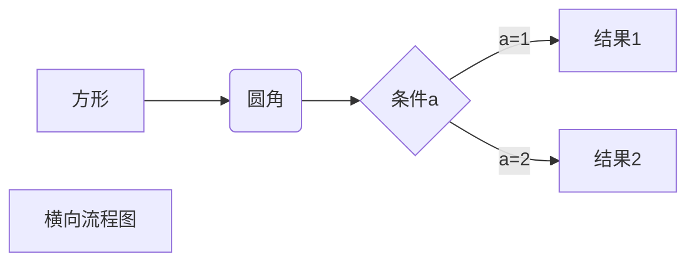

# luanluanspa

> A Vue.js project

## Build Setup

``` bash
# install dependencies
npm install

# serve with hot reload at localhost:8080
npm run dev

# build for production with minification
npm run build

# build for production and view the bundle analyzer report
npm run build --report
```

For a detailed explanation on how things work, check out the [guide](http://vuejs-templates.github.io/webpack/) and [docs for vue-loader](http://vuejs.github.io/vue-loader).


# markdown练习

# 函数式编程（js）

----------------

#### 对于相同的输入，永远会得到相同的输出，而且没有任何可观察的副作用，也不依赖外部环境的状态

* * *

*星号斜体文本*
_下划线斜体文本_

********

**星号粗体文本**
__下划线粗体文本__

- - -

***星号斜粗体文本***
___下划线斜粗体文本___

---

~~删除线~~

<u>下划线</u>

创建脚注格式[^RUNOOB]。
[^RUNOOB]: 想啥嘞 死肥宅

---

1. 第一项
    1. 子项
    1. 子项
    1. 子项
2. 第二项
3. 第三项
4. 第四项

---

### Markdown区块

>区块一
>>区块二
>>>区块三

---

### markdown代码

```javascript
    $(document).ready(function () {
        alert('RUNOOB');
    });
```

---

### markdown链接
我爱[邓紫棋](www.baidu.com)

---

### markdown图片


---

### markdown表格

|  表头   | 表头  | 表头  |
|  :----  | ----  | ----:  |
|  单元格  |  单元格  |  单元格112323  |
|  单元格  |  单元格  |  单元格123  |



